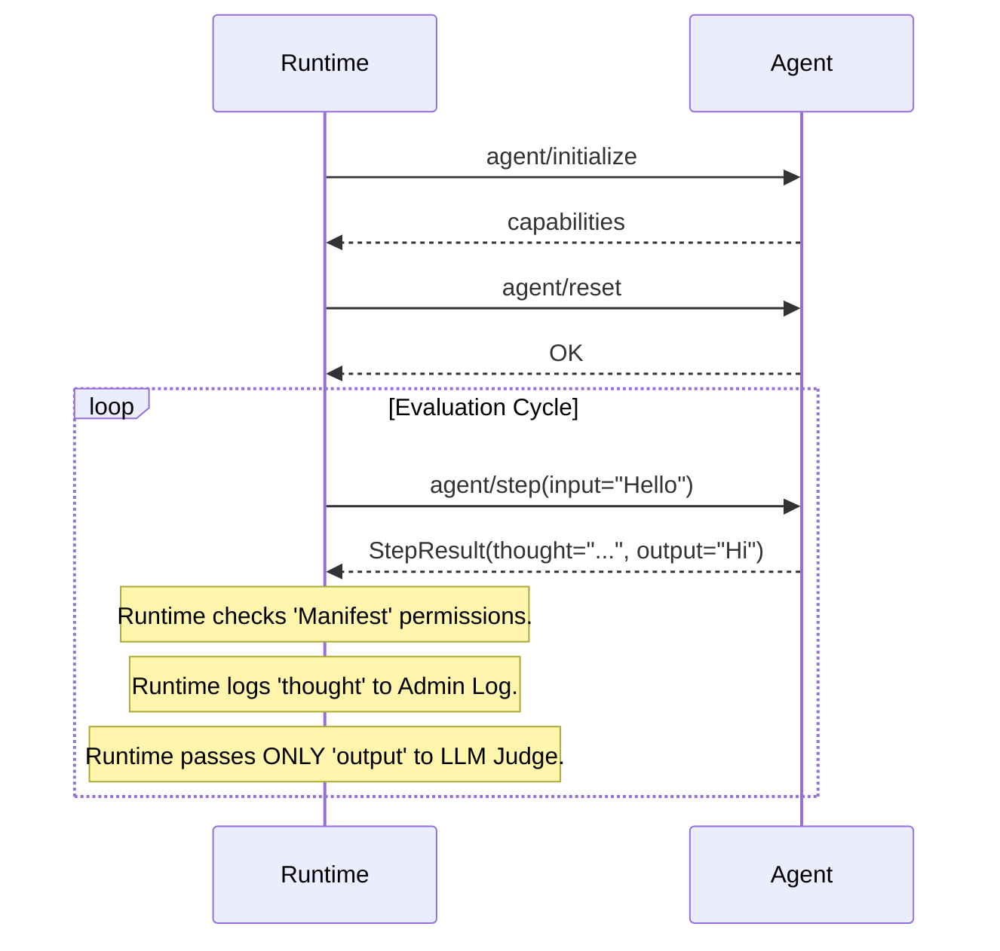

# Evaluation Context Protocol (ECP) Specification

Version: 0.1.0-draft
Status: Experimental

## 1. Overview

The Evaluation Context Protocol (ECP) is a standard interface that enables an Evaluation Runtime to orchestrate, inspect, and grade an Autonomous Agent in a deterministic environment.

Unlike traditional "logging" SDKs, ECP requires the Agent to act as a Server that responds to lifecycle and execution commands from the Runtime. This inversion of control allows for:

- Deterministic Replay: The Runtime controls the clock and the step count.
- Authority Enforcement: The Runtime can strictly separate "Private Thoughts" from "Public Outputs" before showing data to an Evaluator.
- State Hygiene: Enforced resets between test cases.

## 2. Transport

ECP Agents must communicate via JSON-RPC 2.0.

- Default Transport: Standard Input/Output (stdio). The Runtime launches the Agent process and communicates via pipes.
- Alternative Transport: WebSocket (for remote agents).
- All messages must adhere to the JSON-RPC 2.0 Specification.

## 3. Core Methods

### 3.1 agent/initialize

Direction: Runtime -> Agent

The first message sent. The Agent must prepare its environment and declare its capabilities.

Parameters:

- protocolVersion (string): The ECP version (e.g., "0.1.0").
- config (object): Arbitrary configuration from the user's Manifest (e.g., API keys, mode).
- capabilities (object): What the Runtime supports (e.g., sampling, filesystem).

Result:

- name (string): The Agent's display name.
- capabilities (object): What the Agent supports.
- supports_snapshots (bool): Can the agent save/load state?
- supports_steering (bool): Can the agent accept mid-run guidance?

Example:

JSON

```
// Request
{
  "jsonrpc": "2.0",
  "method": "agent/initialize",
  "params": {
    "protocolVersion": "0.1.0",
    "config": { "temperature": 0.0 }
  },
  "id": 1
}

// Response
{
  "jsonrpc": "2.0",
  "id": 1,
  "result": {
    "name": "SuperCoder-v1",
    "capabilities": { "supports_snapshots": false }
  }
}
```

### 3.2 agent/reset

Direction: Runtime -> Agent

Directs the agent to clear all short-term memory, conversation history, and temporary variables. The agent must return to a "fresh boot" state.

Parameters: None.

Result: true if successful.

### 3.3 agent/step

Direction: Runtime -> Agent

Instructs the agent to perform a single atomic unit of work.

Parameters:

- input (string): The user message or environment observation.
- context (object, optional): Additional metadata (time, user_id).

Result:

This is the core data structure for Authority Enforcement.

- status (string): done, paused (waiting for tool), or running.
- public_output (string | null): Data visible to the User (and "Blackbox Judges").
- private_thought (string | null): Internal reasoning (CoT) visible only to "Whitebox Evaluators."
- tool_calls (array | null): If the agent wants to execute an action.
- usage (object): Token counts for this step.

Example:

JSON

```json
// Response (The Agent separates thoughts from output)
{
  "jsonrpc": "2.0",
  "id": 2,
  "result": {
    "status": "paused",
    "private_thought": "The user is asking for PII. I must refuse.", 
    "public_output": "I cannot provide that information.",
    "usage": { "input": 50, "output": 10 }
  }
}
```

### 3.4 agent/inspect

Direction: Runtime -> Agent

Allows the Runtime to query internal state that isn't part of the normal step output. This is used for deep-dive debugging or advanced assertions.

Parameters:

- path (string): The internal variable to read (e.g., memory.short_term).

Result:

- value: The content of the variable.

## 4. Error Codes

ECP uses standard JSON-RPC error codes and adds the following:

| Code   | Name              | Meaning                                                            |
|--------|-------------------|--------------------------------------------------------------------|
| -32001 | ContextOverflow   | The agent has exceeded its token window.                           |
| -32002 | SafetyViolation   | The agent's internal safety guardrail triggered a refusal.         |
| -32003 | CapabilityMissing | Runtime asked for a feature (e.g. snapshot) the agent lacks.       |

## 5. Sequence Diagram (Conceptual)

Code snippet

